# ソフト設計

## 1. 概要

- トレーニングも目的の一つなので、過剰設計上等
- システムアーキテクチャにオニオンアーキテクチャを採用
- GUIアーキテクチャにMVVM簡易版（View+ViewModel & Model）を採用

## 2. コンポーネント図

## 3. ユースケース

### 3.1. 対象ファイルの追加 ユースケース

#### 3.1.1. 対象ファイルの追加 ユースケース　アクティビティ図

#### 3.1.2. 対象ファイルの追加 ユースケース　オブジェクト図

#### 3.1.3. 対象ファイルの追加 ユースケース　シーケンス図

### 3.2. 対象ファイルの削除 ユースケース

#### 3.2.1. 対象ファイルの削除 ユースケース　アクティビティ図

#### 3.2.2. 対象ファイルの削除 ユースケース　オブジェクト図

#### 3.2.3. 対象ファイルの削除 ユースケース　シーケンス図

### 3.3. ファイル名の日付表記をもとにファイル名を変更する ユースケース

#### 3.3.1. ファイル名の日付表記をもとにファイル名を変更する ユースケース　アクティビティ図

#### 3.3.2. ファイル名の日付表記をもとにファイル名を変更する ユースケース　オブジェクト図

#### 3.3.3. ファイル名の日付表記をもとにファイル名を変更する ユースケース　シーケンス図

### 3.4. 撮影日プロパティをもとにファイル名を変更する ユースケース

#### 3.4.1. 撮影日プロパティをもとにファイル名を変更する ユースケース　アクティビティ図

#### 3.4.2. 撮影日プロパティをもとにファイル名を変更する ユースケース　オブジェクト図

#### 3.4.3. 撮影日プロパティをもとにファイル名を変更する ユースケース　シーケンス図

### 3.4. 前処理内容を選択する ユースケース

#### 3.4.1. 前処理内容を選択する ユースケース　アクティビティ図

#### 3.4.2. 前処理内容を選択する ユースケース　オブジェクト図

#### 3.4.3. 前処理内容を選択する ユースケース　シーケンス図

### 3.4. 成果物の出力フォルダ指定 ユースケース

#### 3.4.1. 成果物の出力フォルダ指定 ユースケース　アクティビティ図

#### 3.4.2. 成果物の出力フォルダ指定 ユースケース　オブジェクト図

#### 3.4.3. 成果物の出力フォルダ指定 ユースケース　シーケンス図

### 3.4. 前処理を実行する ユースケース

#### 3.4.1. 前処理を実行する ユースケース　アクティビティ図

#### 3.4.2. 前処理を実行する ユースケース　オブジェクト図

#### 3.4.3. 前処理を実行する ユースケース　シーケンス図

## 4. クラス図

### 4.1. Entityコンポーネント　クラス図

### 4.2. Domain Serviceコンポーネント　クラス図

### 4.3. Repositoryコンポーネント　クラス図

### 4.4. Usecaseコンポーネント　クラス図

### 4.5. Featureコンポーネント　クラス図

### 4.6. Video Processorコンポーネント　クラス図

### 4.7. File Processorコンポーネント　クラス図

### 4.8. In Memory Repositoryコンポーネント　クラス図

### 4.9. UI Partsコンポーネント　クラス図

### 4.10. My Appコンポーネント　クラス図

## 5. GUI
